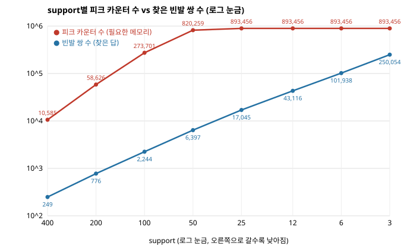

# Task 2 · support를 낮추면 어디서 터지는가

`PlainApriori`, 바구니 20,000개 · 상품 2,000개. `--supports 400,200,100,50,25,12,6,3` (133배 범위, A1)

## A3 · 표

| support | 빈발 쌍 | 피크 카운터 | 시간(초) | 피크 메모리 |
|---:|---:|---:|---:|---:|
| 400 | 249 | 10,585 | 0.98 | 1.1 MB |
| 200 | 776 | 58,626 | 1.58 | 6.7 MB |
| 100 | 2,244 | 273,701 | 3.85 | 28.6 MB |
| 50 | 6,397 | 820,259 | 6.42 | 107.7 MB |
| 25 | 17,045 | 893,456 | 6.51 | 107.7 MB |
| 12 | 43,116 | 893,456 | 6.76 | 109.8 MB |
| 6 | 101,938 | 893,456 | 7.20 | 126.5 MB |
| 3 | 250,054 | 893,456 | 7.52 | 163.7 MB |

## A5 · 그래프

## 답변

- A2: support 3까지 터지지 않았다 (7.5초, 164 MB, RAM 15.4 GB). 비용이 급해진 곳은 100 → 50(메모리 28.6 → 107.7 MB)이고, 데이터가 작아 25 이하에서는 카운터가 893,456개에서 멈춘다.
- A4: 절반으로 줄일 때 카운터는 ×5.5 → ×4.7 → ×3.0 (400 → 50)으로 **2배보다 빠르게** 늘었다. 빈발 상품이 늘면 쌍은 상품 수의 제곱으로 늘기 때문이다.
- A5: 답은 절반마다 ×2.4~3.1로 꾸준히 늘고 카운터는 초반에 더 가파르다. support 50에서 답 6,397개에 카운터 820,259개(답당 128개)이고, 이 격차가 §6.3 PCY가 필요한 이유다.
- A6: Intel Core Ultra 5 225H (14코어), RAM 15.4 GB, Windows 11, Python 3.14.3. VS Code 등 평소 앱만 실행 중이었고, 메모리 열은 `tracemalloc` 피크다.
